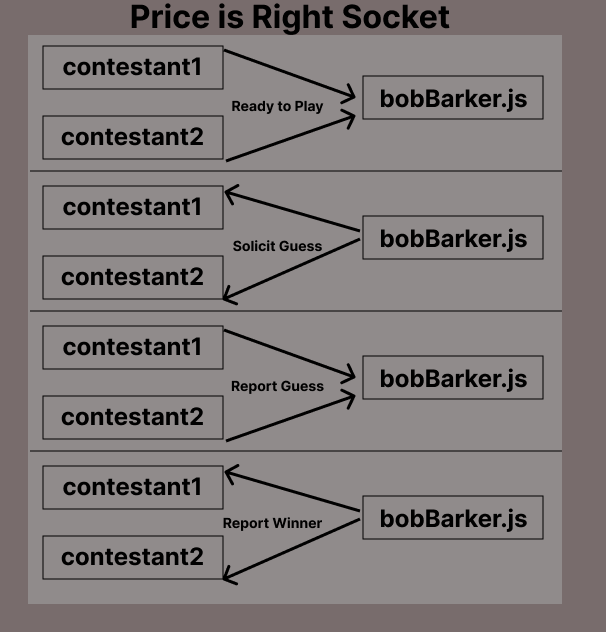

# price-is-right (LAB 14)

## Bad simulation of price-is-right contestant selection

### Author: Jeremy Cleland & Tyler Bennett

### Problem Domain  

Begin a simple guessing game when 2 clients connect, and then determine who's guess is closest without going over.

### Links and Resources

- [ci/cd](https://github.com/tyler-bennett52/price-is-right/actions/new) (GitHub Actions)

#### How to initialize/run your application (where applicable)

- To run this program you will need to initialize bobBarker.js first, and then each of the two contestant files. Once both contestants are connected the guessing game will begin

#### Features / Routes

- Prompts contestants to guess the price of a brand new car. Price should be between 20000-30000.

#### Tests

- How do you run tests? -  npm test

#### UML

#### Attribution

Result of a collaboration between Jeremy Cleland & Tyler Bennett
